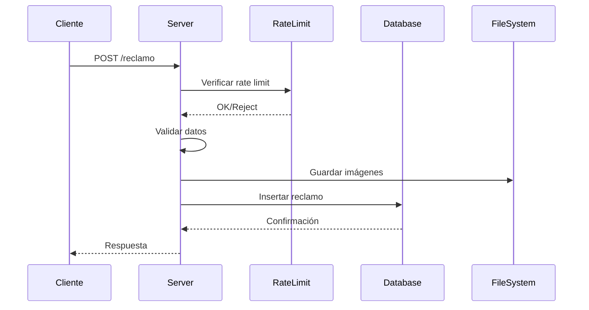
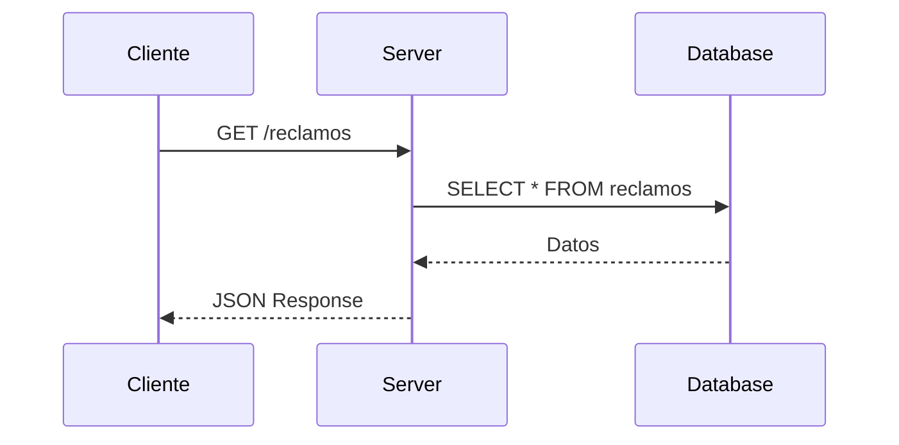

# Arquitectura del Backend - Mapa Tandil

## 🏗️ Visión General

El backend del proyecto Mapa Tandil está construido con Node.js y Express.js, proporcionando una API RESTful para la gestión de reclamos ciudadanos. La arquitectura está diseñada para ser escalable, segura y fácil de mantener.

## 📋 Stack Tecnológico

### Core
- **Runtime**: Node.js
- **Framework**: Express.js 4.21.0
- **Base de Datos**: MySQL 5.7+
- **ORM**: Knex.js 3.1.0

### Dependencias Principales
- **cors**: 2.8.5 - Configuración de CORS
- **dotenv**: 16.4.5 - Gestión de variables de entorno
- **express-rate-limit**: 7.4.1 - Rate limiting
- **mysql2**: 3.11.3 - Driver de MySQL
- **uuid**: 10.0.0 - Generación de UUIDs
- **cheerio**: 1.0.0 - Parsing HTML (para futuras funcionalidades)

## 🏛️ Arquitectura de Capas

```
┌─────────────────────────────────────┐
│           API Layer                 │
│  (Express Routes & Middleware)      │
├─────────────────────────────────────┤
│         Business Logic              │
│     (Request Processing)            │
├─────────────────────────────────────┤
│         Data Access Layer           │
│        (Knex.js ORM)                │
├─────────────────────────────────────┤
│         Database Layer              │
│           (MySQL)                   │
└─────────────────────────────────────┘
```

## 📁 Estructura de Archivos

```
back/
├── server.js                    # Punto de entrada principal
├── rateLimit.js                # Configuración de rate limiting
├── definicion_inicial_db.sql   # Esquema de base de datos
├── package.json                # Dependencias y scripts
├── .gitignore                  # Archivos ignorados por Git
└── user_data/                  # Directorio para imágenes (creado dinámicamente)
```

## 🔧 Componentes Principales

### 1. Server.js - Servidor Principal

**Responsabilidades:**
- Configuración del servidor Express
- Configuración de middleware
- Definición de rutas
- Conexión a base de datos
- Manejo de errores

**Características:**
- Configuración de CORS dinámica
- Rate limiting por endpoint
- Parsing de JSON con límite de 10MB
- Servir archivos estáticos
- Logging de requests

### 2. RateLimit.js - Control de Frecuencia

**Funcionalidad:**
- Limita el número de requests por IP
- Previene spam y ataques de fuerza bruta
- Configuración personalizable por endpoint

### 3. Base de Datos

**Motor:** MySQL con InnoDB
**Pool de Conexiones:** Configurado para 0-1000 conexiones

**Tablas:**
- `reclamos`: Almacena los reclamos ciudadanos
- `reportes`: Almacena reportes adicionales sobre reclamos

## 🔄 Flujo de Datos

### Creación de Reclamo



### Consulta de Reclamos



## 🛡️ Seguridad

### 1. Rate Limiting
- **Implementación**: express-rate-limit
- **Configuración**: Personalizada por endpoint
- **Propósito**: Prevenir spam y ataques

### 2. CORS
- **Configuración**: Dinámica basada en variables de entorno
- **Orígenes**: Configurables via `cors_origin`
- **Credenciales**: Habilitadas

### 3. Validación de Entrada
- **Título**: Máximo 255 caracteres, requerido
- **Detalles**: Máximo 1024 caracteres, requerido
- **Posición**: Coordenadas geográficas requeridas
- **Imágenes**: Base64 con validación de formato

### 4. Sanitización
- **IP Address**: Captura de IP real con proxy support
- **User Agent**: Captura de información del navegador
- **Timestamps**: Generación automática de timestamps

## 📊 Modelo de Datos

### Tabla: reclamos
```sql
CREATE TABLE `reclamos` (
    `id` VARCHAR(36) NOT NULL,
    `titulo` VARCHAR(255) NOT NULL,
    `detalles` VARCHAR(1024) NOT NULL,
    `imagenes` JSON NOT NULL,
    `ipv4` VARCHAR(255) NOT NULL,
    `ipv6` VARCHAR(255) NOT NULL,
    `ts` DATETIME NOT NULL,
    `user_agent` VARCHAR(255) NOT NULL,
    `posicion` VARCHAR(255) NOT NULL,
    PRIMARY KEY (`id`)
) ENGINE = InnoDB;
```

### Tabla: reportes
```sql
CREATE TABLE `reportes` (
    `id` VARCHAR(36) NOT NULL,
    `detalle` VARCHAR(255) NOT NULL,
    `ts` DATETIME NOT NULL,
    `ipv4` VARCHAR(255) NOT NULL,
    `ipv6` VARCHAR(255) NOT NULL,
    `user_agent` VARCHAR(255) NOT NULL,
    `reclamo_id` VARCHAR(36) NOT NULL,
    PRIMARY KEY (`id`(36))
) ENGINE = InnoDB;
```

## 🔌 API Endpoints

### GET /reclamos
- **Propósito**: Obtener todos los reclamos
- **Método**: GET
- **Autenticación**: No requerida
- **Respuesta**: JSON con array de reclamos

### POST /reclamo
- **Propósito**: Crear nuevo reclamo
- **Método**: POST
- **Autenticación**: No requerida
- **Rate Limiting**: Sí
- **Validación**: Completa
- **Respuesta**: JSON con status

## 🗂️ Gestión de Archivos

### Almacenamiento de Imágenes
- **Formato**: Base64
- **Ubicación**: `./user_data/`
- **Nomenclatura**: UUID v7 + extensión original
- **Metadatos**: Almacenados en JSON en la base de datos

### Proceso de Guardado
1. Decodificación de Base64
2. Generación de UUID único
3. Preservación de extensión original
4. Escritura en sistema de archivos
5. Almacenamiento de metadatos en DB

## ⚙️ Configuración

### Variables de Entorno
```env
service_port_api=3000
cors_origin=http://localhost:8080
mysql_host=localhost
mysql_user=usuario
mysql_password=password
mysql_database=mapa_tandil
```

### Configuración de Base de Datos
```javascript
{
    host: process.env.mysql_host,
    user: process.env.mysql_user,
    password: process.env.mysql_password,
    database: process.env.mysql_database,
    supportBigNumbers: true,
    bigNumberStrings: true,
    typeCast: function (field, next) {
        if (field.type == "NEWDECIMAL") {
            var value = field.string();
            return (value === null) ? null : Number(value);
        }
        return next();
    }
}
```

## 🔍 Logging y Monitoreo

### Logs Implementados
- **Requests**: Log de todos los endpoints accedidos
- **Errores**: Log de errores con stack trace
- **Operaciones DB**: Log de operaciones de base de datos
- **Rate Limiting**: Log de requests bloqueados

### Información Capturada
- **IP Address**: IPv4 e IPv6
- **User Agent**: Información del navegador
- **Timestamp**: Hora exacta de cada operación
- **Request Data**: Datos de entrada (sin información sensible)

## 🚀 Escalabilidad

### Consideraciones de Escalabilidad
1. **Pool de Conexiones**: Configurado para alta concurrencia
2. **Rate Limiting**: Protección contra sobrecarga
3. **Validación**: Prevención de datos maliciosos
4. **Modularidad**: Código organizado para fácil mantenimiento

### Optimizaciones Futuras
- **Caching**: Implementar Redis para cache
- **CDN**: Servir imágenes desde CDN
- **Load Balancer**: Distribuir carga entre múltiples instancias
- **Microservicios**: Separar funcionalidades en servicios independientes

## 🧪 Testing

### Estrategia de Testing
- **Unit Tests**: Para funciones individuales
- **Integration Tests**: Para endpoints de API
- **Load Tests**: Para verificar performance
- **Security Tests**: Para validar medidas de seguridad

### Herramientas Recomendadas
- **Jest**: Framework de testing
- **Supertest**: Testing de APIs
- **Artillery**: Load testing
- **OWASP ZAP**: Security testing

## 📈 Métricas y Monitoreo

### Métricas Clave
- **Requests por segundo**
- **Tiempo de respuesta promedio**
- **Tasa de errores**
- **Uso de memoria y CPU**
- **Conexiones de base de datos activas**

### Herramientas de Monitoreo
- **PM2**: Process manager con métricas
- **New Relic**: APM y monitoreo
- **DataDog**: Monitoreo completo
- **Grafana**: Visualización de métricas

## 🔄 Deployment

### Entornos
- **Desarrollo**: Local con hot reload
- **Staging**: Entorno de pruebas
- **Producción**: Entorno de usuarios finales

### Proceso de Deployment
1. **Build**: Preparación de assets
2. **Test**: Ejecución de tests automatizados
3. **Deploy**: Despliegue a servidor
4. **Health Check**: Verificación de funcionamiento
5. **Monitoring**: Activación de monitoreo

---

**Versión**: 0.2.0  
**Última actualización**: 2024  
**Mantenido por**: Equipo de Desarrollo Mapa Tandil 