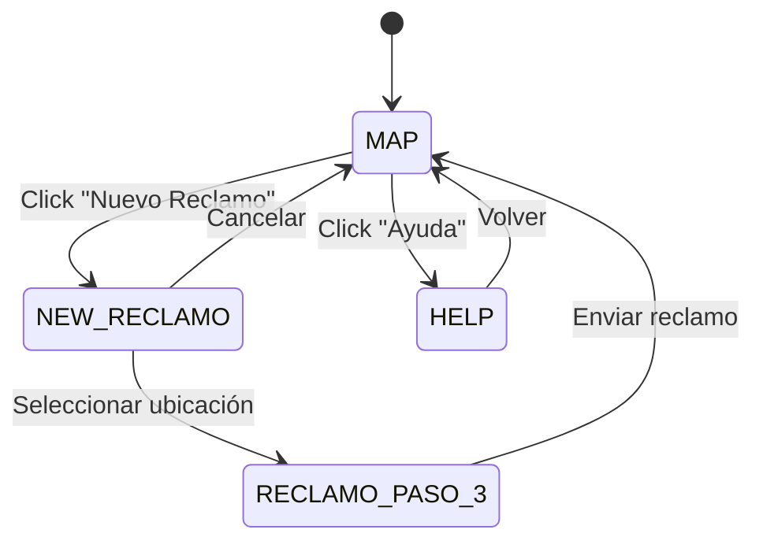
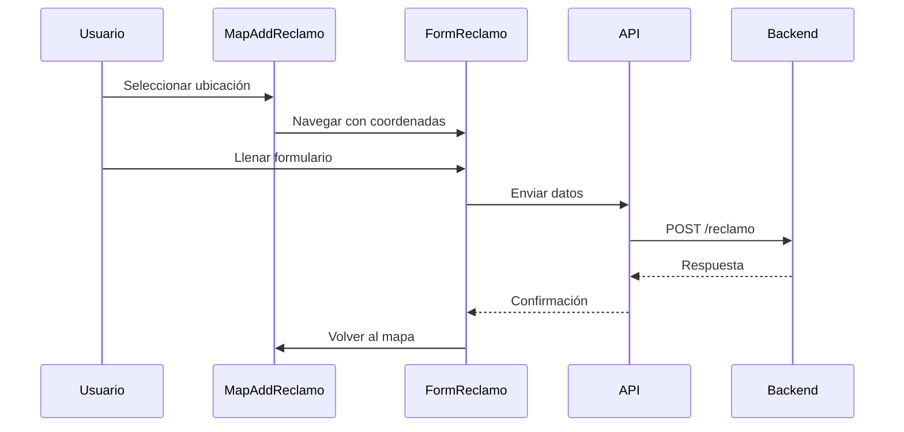

# Arquitectura del Frontend - Mapa Tandil

## 🎨 Visión General

El frontend del proyecto Mapa Tandil es una aplicación web moderna construida con Vue.js 3, que proporciona una interfaz de usuario intuitiva y responsiva para la gestión de reclamos ciudadanos. La aplicación utiliza OpenLayers para la visualización de mapas interactivos y PrimeVue para los componentes de interfaz.

## 📋 Stack Tecnológico

### Core Framework
- **Vue.js**: 3.2.13 - Framework progresivo de JavaScript
- **Composition API**: API moderna de Vue 3 para lógica reutilizable
- **Vue CLI**: 5.0.0 - Herramientas de desarrollo y build

### Mapas y Geovisualización
- **OpenLayers**: 10.2.1 - Biblioteca de mapas de código abierto
- **vue3-openlayers**: 11.2.1 - Integración de OpenLayers con Vue 3
- **ol-contextmenu**: 5.5.0 - Menús contextuales para mapas
- **ol-ext**: 4.0.23 - Extensiones para OpenLayers

### UI/UX Framework
- **PrimeVue**: 4.1.0 - Biblioteca de componentes Vue
- **PrimeFlex**: 3.3.1 - Framework CSS utilitario
- **PrimeIcons**: 7.0.0 - Iconografía
- **Bootstrap Icons**: 1.11.3 - Iconos adicionales

### HTTP Client
- **Axios**: 1.7.7 - Cliente HTTP para peticiones a la API

### Desarrollo y Build
- **Sass**: 1.32.7 - Preprocesador CSS
- **ESLint**: 7.32.0 - Linter de código JavaScript
- **Vue CLI Service**: 5.0.0 - Servidor de desarrollo y build

## 🏛️ Arquitectura de Componentes

```
┌─────────────────────────────────────┐
│           App.vue                   │
│      (Componente Principal)         │
├─────────────────────────────────────┤
│         MenuGral.vue                │
│      (Navegación Principal)         │
├─────────────────────────────────────┤
│  ┌─────────────┬─────────────────┐  │
│  │  MapGral    │  MapAddReclamo  │  │
│  │ (Vista Mapa)│ (Agregar Punto) │  │
│  └─────────────┴─────────────────┘  │
│  ┌─────────────┬─────────────────┐  │
│  │ FormReclamo │   HelpPage      │  │
│  │ (Formulario)│  (Página Ayuda) │  │
│  └─────────────┴─────────────────┘  │
└─────────────────────────────────────┘
```

## 📁 Estructura de Archivos

```
front/
├── public/                          # Archivos públicos
│   ├── favicon.ico
│   └── index.html                   # Template HTML principal
├── src/
│   ├── api/                         # Servicios de API
│   │   └── reclamos.js              # Endpoints de reclamos
│   ├── assets/                      # Recursos estáticos
│   │   └── img_p1.png, img_p2.png, etc.
│   ├── components/                  # Componentes Vue
│   │   ├── map-view/               # Componentes de mapas
│   │   │   ├── MapGral.vue         # Vista principal del mapa
│   │   │   ├── MapAddReclamo.vue   # Agregar punto al mapa
│   │   │   └── DetallePunto.vue    # Detalle de punto seleccionado
│   │   ├── FormReclamo.vue         # Formulario de reclamos
│   │   ├── HelpPage.vue            # Página de ayuda
│   │   ├── ImagenesInput.vue       # Input de imágenes
│   │   ├── MenuGral.vue            # Menú de navegación
│   │   └── ToastsCtrl.vue          # Control de notificaciones
│   ├── helpers/                     # Utilidades y helpers
│   │   ├── request.js              # Configuración de Axios
│   │   └── formatter.js            # Funciones de formateo
│   ├── App.vue                      # Componente raíz
│   └── main.js                      # Punto de entrada
├── package.json                     # Dependencias y scripts
├── jsconfig.json                    # Configuración de JavaScript
└── .gitignore                       # Archivos ignorados
```

## 🔧 Componentes Principales

### 1. App.vue - Componente Raíz

**Responsabilidades:**
- Gestión del estado de navegación
- Renderizado condicional de componentes
- Manejo del contexto de la aplicación
- Configuración de estilos globales

**Características:**
- Sistema de navegación basado en estados
- Contexto compartido entre componentes
- Estilos SCSS globales
- Layout responsive con Bootstrap

### 2. MenuGral.vue - Navegación Principal

**Funcionalidad:**
- Menú de navegación superior
- Botones para diferentes secciones
- Emisión de eventos de navegación
- Diseño responsive

### 3. MapGral.vue - Vista Principal del Mapa

**Características:**
- Mapa interactivo con OpenLayers
- Visualización de reclamos existentes
- Interacción con puntos del mapa
- Configuración de capas y estilos

### 4. MapAddReclamo.vue - Agregar Reclamo

**Funcionalidad:**
- Selección de ubicación en el mapa
- Interfaz para marcar puntos
- Navegación al formulario de reclamo
- Validación de coordenadas

### 5. FormReclamo.vue - Formulario de Reclamo

**Características:**
- Formulario multi-paso
- Validación de campos
- Carga de imágenes
- Envío de datos a la API

### 6. ImagenesInput.vue - Gestión de Imágenes

**Funcionalidad:**
- Carga múltiple de imágenes
- Preview de imágenes
- Conversión a Base64
- Validación de formatos

## 🔄 Flujo de Datos

### Navegación de Componentes



### Creación de Reclamo



## 🗺️ Sistema de Mapas

### Configuración de OpenLayers

**Capas Principales:**
- **OSM**: OpenStreetMap como capa base
- **Puntos**: Capa de reclamos existentes
- **Marcador**: Punto de nuevo reclamo

**Interacciones:**
- **Click**: Seleccionar punto existente
- **Doble Click**: Agregar nuevo punto
- **Hover**: Mostrar información del punto
- **Zoom/Pan**: Navegación del mapa

### Estilos de Puntos

```javascript
// Estilo para puntos existentes
const pointStyle = new Style({
    image: new CircleStyle({
        radius: 8,
        fill: new Fill({ color: '#ff4444' }),
        stroke: new Stroke({ color: '#ffffff', width: 2 })
    })
});

// Estilo para punto seleccionado
const selectedStyle = new Style({
    image: new CircleStyle({
        radius: 12,
        fill: new Fill({ color: '#4444ff' }),
        stroke: new Stroke({ color: '#ffffff', width: 3 })
    })
});
```

## 🔌 Servicios de API

### Configuración de Axios

```javascript
// helpers/request.js
const service = axios.create({
    baseURL: process.env.VUE_APP_API_URL,
    withCredentials: true,
    timeout: 30000
});
```

### Endpoints Disponibles

```javascript
// api/reclamos.js
export function get_reclamos() {
    return request({ url: '/reclamos', method: 'get' })
}

export function new_reclamo(datos) {
    return request({ url: '/reclamo', method: 'post', data: datos })
}

export function get_reclamo(id) {
    return request({ url: '/reclamo?id=' + id, method: 'get' })
}
```

## 🎨 Sistema de Estilos

### Framework CSS
- **PrimeFlex**: Sistema de utilidades CSS
- **SCSS**: Preprocesador para estilos personalizados
- **Responsive Design**: Adaptable a diferentes dispositivos

### Variables de Estilo
```scss
// Colores principales
$primary-color: #4a0000;
$secondary-color: #ffffff;
$accent-color: #ff4444;

// Espaciado
$spacing-unit: 1rem;
$border-radius: 1rem;

// Z-index
$modal-z-index: 1000;
$overlay-z-index: 999;
```

## 📱 Responsive Design

### Breakpoints
- **Mobile**: < 768px
- **Tablet**: 768px - 1024px
- **Desktop**: > 1024px

### Adaptaciones
- **Menú**: Colapsable en móviles
- **Mapa**: Tamaño adaptativo
- **Formularios**: Layout vertical en móviles
- **Imágenes**: Grid responsive

## 🔧 Configuración

### Variables de Entorno
```env
VUE_APP_API_URL=http://localhost:3000
```

### Configuración de Build
```javascript
// vue.config.js (implícito)
module.exports = {
    publicPath: '/',
    outputDir: 'dist',
    assetsDir: 'static',
    productionSourceMap: false
}
```

## 🚀 Scripts de Desarrollo

### Comandos Disponibles
```bash
# Servidor de desarrollo
npm run serve

# Build para producción
npm run build

# Linting
npm run lint
```

### Configuración de ESLint
```json
{
    "extends": [
        "plugin:vue/vue3-essential",
        "eslint:recommended"
    ],
    "parserOptions": {
        "ecmaVersion": 2020
    }
}
```

## 🧪 Testing

### Estrategia de Testing
- **Unit Tests**: Para componentes individuales
- **Integration Tests**: Para flujos de usuario
- **E2E Tests**: Para casos de uso completos

### Herramientas Recomendadas
- **Vue Test Utils**: Testing de componentes Vue
- **Jest**: Framework de testing
- **Cypress**: Testing end-to-end

## 📈 Performance

### Optimizaciones Implementadas
1. **Lazy Loading**: Carga diferida de componentes
2. **Image Optimization**: Compresión de imágenes
3. **Code Splitting**: División de bundles
4. **Caching**: Cache de recursos estáticos

### Métricas de Performance
- **First Contentful Paint**: < 2s
- **Largest Contentful Paint**: < 3s
- **Cumulative Layout Shift**: < 0.1
- **First Input Delay**: < 100ms

## 🔒 Seguridad

### Medidas Implementadas
- **CORS**: Configurado en el backend
- **Input Validation**: Validación en frontend y backend
- **XSS Prevention**: Sanitización de datos
- **CSRF Protection**: Tokens de seguridad

## 🔄 Estado de la Aplicación

### Gestión de Estado
- **Local State**: Usando `ref()` y `reactive()`
- **Component Communication**: Props y eventos
- **Context Sharing**: Objeto de contexto global

### Patrones de Estado
```javascript
// Estado de navegación
const ultimo_click_menu = ref({ id: "MAP" })

// Contexto compartido
const context = ref({
    posicion: []
})

// Función de navegación
async function click_menu(enlace) {
    ultimo_click_menu.value = enlace
    context.value = {...context.value, ...enlace?.context}
}
```

## 🎯 Accesibilidad

### Características de Accesibilidad
- **ARIA Labels**: Etiquetas para lectores de pantalla
- **Keyboard Navigation**: Navegación por teclado
- **Color Contrast**: Contraste adecuado
- **Focus Management**: Gestión del foco

## 📊 Analytics y Monitoreo

### Métricas de Usuario
- **Page Views**: Páginas visitadas
- **User Interactions**: Interacciones con el mapa
- **Form Submissions**: Reclamos enviados
- **Error Tracking**: Errores de la aplicación

### Herramientas Recomendadas
- **Google Analytics**: Métricas de usuario
- **Sentry**: Error tracking
- **Hotjar**: Heatmaps y grabaciones

## 🔄 Deployment

### Build de Producción
```bash
npm run build
```

### Archivos Generados
- `dist/index.html`: Archivo principal
- `dist/static/`: Recursos estáticos
- `dist/static/css/`: Estilos compilados
- `dist/static/js/`: JavaScript compilado

### Configuración de Servidor
- **SPA Routing**: Configuración para Vue Router
- **Static File Serving**: Servir archivos estáticos
- **Gzip Compression**: Compresión de archivos
- **Cache Headers**: Headers de cache apropiados

---

**Versión**: 0.4.3  
**Última actualización**: 2024  
**Mantenido por**: Equipo de Desarrollo Mapa Tandil 